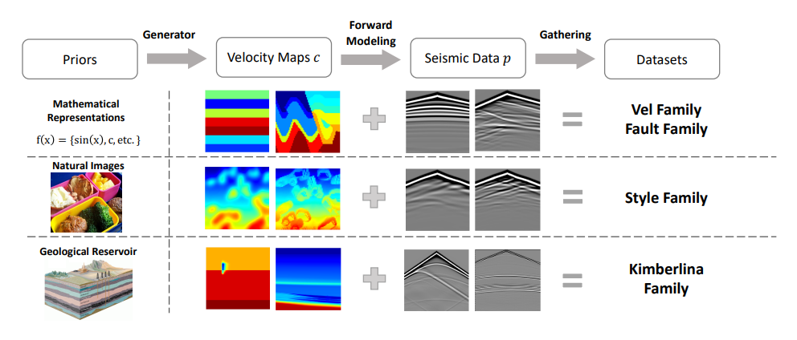

# Physics-Guided Machine Learning for Full-Waveform Inversion

A deep learning approach to solve full-waveform inversion (FWI) problems using physics-guided machine learning models with MetaFormer and ConvNeXt architectures.

## Overview

Full-Waveform Inversion (FWI) is a computational method to reconstruct subsurface velocity models from seismic data. This project leverages state-of-the-art deep learning architectures combined with physics-based constraints to achieve accurate velocity model predictions.



## Key Features

- **Physics-Guided Learning**: Combines data-driven deep learning with physical wave propagation modeling
- **State-of-the-Art Architectures**: Implements MetaFormer and ConvNeXt models with custom modifications
- **Physical Loss Function**: Integrates seismic wave equation simulation for physics-consistent predictions
- **EMA Model Wrapper**: Exponential Moving Average (EMA) for stable training and improved generalization
- **Strong Performance**: Achieves MAE of 23.6 on the OpenFWI dataset

## Architecture

### Model Components

1. **Encoder**: Pre-trained ConvNeXt or MetaFormer backbone
   - ConvNeXt Small/Large (ImageNet-22k pre-trained)
   - CAFormer-B36 (SAIL ImageNet-22k pre-trained)
   - Custom stem modifications for seismic data input (5 channels)

2. **Decoder**: UNet-style decoder with:
   - Multi-scale skip connections
   - SCSE (Spatial and Channel Squeeze & Excitation) attention
   - Pixelshuffle/Deconvolution upsampling
   - Intermediate convolution layers

3. **Physics Simulator**: 2D acoustic wave equation solver
   - Finite difference time-domain (FDTD) method
   - Absorbing boundary conditions (ABC)
   - Ricker wavelet source
   - Batched multi-source simulation

### Training Techniques

- **EMA (Exponential Moving Average)**: Decay rate of 0.99 for model parameter smoothing
- **SAM Optimizer**: Sharpness-Aware Minimization (available)
- **Mixed Precision Training**: FP16 with Lightning Fabric
- **Test-Time Augmentation**: Horizontal flip averaging during inference
- **Scheduler**: Constant learning rate with cosine annealing

## Installation

### Requirements

```bash
pip install -r requirement.txt
```

### Dependencies

- Python 3.8+
- PyTorch 2.6.0
- Lightning
- MONAI
- timm (PyTorch Image Models)
- transformers
- numpy
- tqdm

## Dataset

The project uses the **OpenFWI** dataset, a comprehensive benchmark for machine learning in seismic inversion.

- **Input**: Seismic waveforms (5 sources × 1001 timesteps × 70 receivers)
- **Output**: Velocity model (70 × 70 grid)
- Dataset path configurable in `config.py`

## Usage

### Configuration

Edit `config.py` to set your preferences:

```python
cfg.data_path = "path/to/your/data/"
cfg.backbone = "convnext_large.fb_in22k_ft_in1k"
cfg.batch_size = 32
cfg.epochs = 100
cfg.ema = True
cfg.ema_decay = 0.99
```

### Training

#### Single GPU Training
```bash
bash run.sh
```

#### Distributed Training with Lightning Fabric
```bash
bash run_fabric.sh
```

#### Multi-GPU with DDP
```bash
torchrun --nproc_per_node=NUM_GPUS train_lightning_fabric.py
```

### Physics Simulation

Original Matlab implementation can found at [here](https://csim.kaust.edu.sa/files/SeismicInversion/Chapter.FD/lab.FD2.8/lab.html).

The `vel2seis.py` module provides differentiable seismic wave propagation:

```python
from vel2seis import SeismicGeometry

# Initialize geometry
geom = SeismicGeometry(
    source_positions=[0, 17, 34, 52, 69],
    nbc=120,
    nx=70,
    dx=10.0,
    freq=15.0,
    dt=1e-3,
    nt=1001,
    device="cuda"
)

# Simulate seismic data from velocity model
seismograms = geom.simulate(velocity_model)
```

## Model Details

### Input Format
- **Seismic Data**: Shape `(B, 5, 1001, 70)` - Batch × Sources × Time × Receivers
- Preprocessed to 5-channel input for the encoder

### Output Format
- **Velocity Model**: Shape `(B, 1, 70, 70)` - Batch × Channel × Height × Width
- Represents subsurface velocity structure in m/s

### Custom Modifications
- **Adaptive Stride**: Custom striding `(4, 1)` in stem for seismic data geometry
- **Reflection Padding**: 80-pixel padding to handle boundary conditions
- **Activation Replacement**: All activations replaced with GELU
- **Normalization**: InstanceNorm2d for stability with seismic data

## Results

| Model | MAE | Notes |
|-------|-----|-------|
| ConvNeXt + Physics Loss + EMA | **23.6** | OpenFWI dataset |

## Project Structure

```
.
├── config.py                    # Configuration settings
├── dataset.py                   # Data loading and preprocessing
├── model.py                     # Model architectures (UNet, EMA, Ensemble)
├── vel2seis.py                 # Physics-based seismic simulation
├── train.py                     # Training script
├── train_lightning_fabric.py    # Distributed training with Fabric
├── vr_adam.py                   # Custom optimizer utilities
├── requirement.txt              # Package dependencies
├── run.sh                       # Training launch script
└── run_fabric.sh               # Distributed training launch script
```

## Key Innovations

1. **Physics-Guided Loss**: Combines L1 loss on velocity predictions with physics-based seismic simulation loss
2. **Domain-Adapted Architecture**: Modified ConvNeXt/MetaFormer stems and normalization for seismic data
3. **Multi-Source Geometry**: Batched simulation supporting multiple source positions simultaneously
4. **Differentiable Physics**: Fully differentiable wave equation solver for end-to-end training